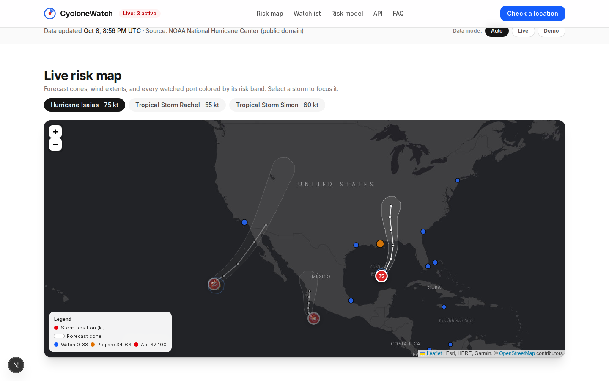
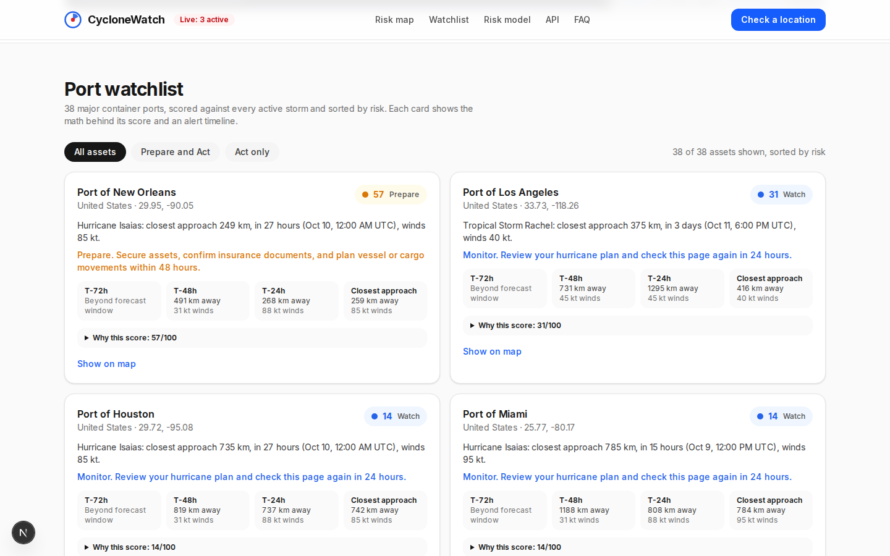
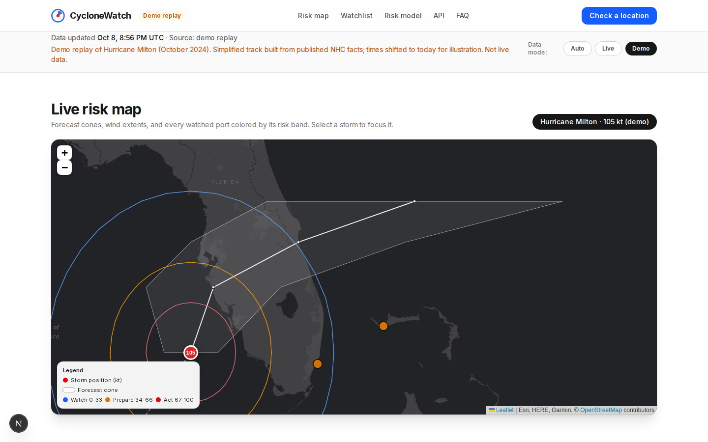
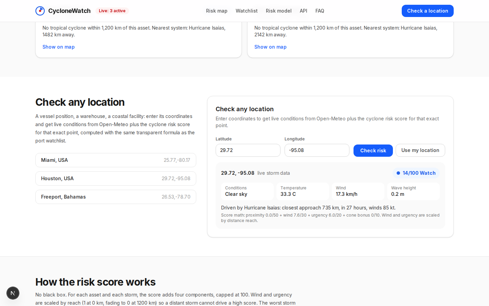
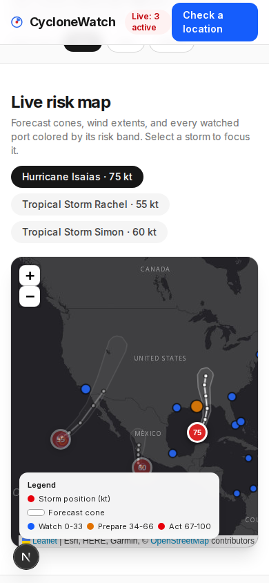

# CycloneWatch

Live tropical cyclone risk alerts for shipping, insurance, and coastal communities. CycloneWatch turns official hurricane forecasts into transparent 0-100 risk scores for ports, vessels, and any latitude/longitude on Earth, with the math shown for every score.

Keywords: tropical cyclone alerts, hurricane tracker, typhoon risk, storm surge, shipping risk, parametric insurance.



## Screenshots

| Live map (3 active storms, Oct 2026) | Port watchlist |
|---|---|
|  |  |

| Demo replay (Hurricane Milton, Oct 2024) | Location check + mobile |
|---|---|
|  |   |

## Quickstart

Requirements: Node.js 20+.

```bash
npm install
npm run dev      # http://localhost:3000
```

```bash
npm run lint     # ESLint, must be clean
npm run build    # production build, must be clean
```

No API keys needed. All data sources are free.

## Configuration

CycloneWatch needs **no environment variables and no API keys**, in development or production.

| Source | Auth | Notes |
| ------ | ---- | ----- |
| NOAA National Hurricane Center (storm tracks, forecast cones) | None | Public domain GeoJSON, fetched server-side |
| Open-Meteo (point conditions) | None | Keyless public API |

If you add a keyed provider later, document it in this table.

## Features

- **Live risk map** (Leaflet, dark basemap): active storm tracks, official forecast cones of uncertainty, 34/50/64 kt wind extent rings, and 38 major world container ports colored by risk band.
- **Transparent risk engine**: every asset scores 0-100 from four documented components. Each card shows its own math under "Why this score". No black box.
- **Port watchlist**: 38 ports sorted by risk, with storm name, closest-approach time and distance, wind, alert timelines (T-72h, T-48h, T-24h, closest approach), and Watch / Prepare / Act action bands with stated numeric cutoffs.
- **Check any location**: enter coordinates (or use browser geolocation) for live Open-Meteo conditions plus the cyclone risk score at that exact point.
- **Honest states**: a real "No active tropical cyclones" empty state, and a clearly badged demo replay (Hurricane Milton, Oct 2024) that is never mixed silently with live data.
- **Agent-friendly API**: `GET /api/storms`, `GET /api/risk?lat=..&lon=..`, `GET /api/health`. Machine-readable docs in `public/llms.txt` and `SKILL.md` (Claude Code skill).

## API

No key required. Responses are JSON.

```
GET /api/storms?mode=auto|live|demo
```
Active (or demo) storms with forecast tracks, cones, wind extents, past tracks. `auto` (default) serves live data when storms are active and the labeled demo replay when quiet. `live` returns real data only.

```
GET /api/risk?lat=25.77&lon=-80.17&mode=auto|live|demo
```
Risk score for any point plus live Open-Meteo conditions. Returns 400 for invalid coordinates.

```
GET /api/health
```
Service status and an NHC reachability probe.

Example:

```json
{
  "point": { "lat": 25.77, "lon": -80.17 },
  "stormMode": "live",
  "risk": {
    "score": 82,
    "band": "act",
    "stormName": "Isaias",
    "closestDistanceKm": 145,
    "closestWindKt": 95,
    "leadTimeHours": 31,
    "inCone": true,
    "components": { "proximity": 37.9, "wind": 21.9, "urgency": 14.8, "coneBonus": 10 }
  },
  "conditions": { "temperatureC": 29.7, "windKph": 29.6, "waveHeightM": 0.34 }
}
```

## The risk model

For an asset at (lat, lon) and a storm, with d = distance to the forecast track (km), w = max sustained wind at the closest forecast point (kt), t = lead time to closest approach (hours):

- **Proximity** (0-50): `(1 - d/600) * 50`. Zero beyond 600 km.
- **Reach** (0-1): `(1 - d/1200)`, floored at 0.
- **Wind** (0-30): `(w/130) * 30 * reach`. Full marks at 130+ kt close in.
- **Urgency** (0-20): `(1 - t/120) * 20 * reach`. Full marks when closest approach is now.
- **Cone bonus** (0 or 10): 10 when the asset sits inside the official forecast cone.

Score = proximity + wind + urgency + cone bonus, capped at 100. Wind and urgency are scaled by reach so a distant storm cannot score high on intensity or timing alone. The worst storm drives each asset's score.

Bands: **0-33 Watch** (blue, monitor), **34-66 Prepare** (amber, secure assets within 48 hours), **67-100 Act** (red, execute your storm plan now).

## Data sources and licenses

| Source | What | License |
|---|---|---|
| NOAA National Hurricane Center | Storm positions, forecast tracks, cones, wind extents, advisories | US public domain |
| Open-Meteo | Current weather and marine conditions | CC-BY 4.0 (attribute Open-Meteo.com) |
| Esri World Dark Gray | Map tiles (via same-origin proxy) | Esri, HERE, Garmin, OpenStreetMap contributors |
| This app's code | Everything in this repo | MIT |

Live NHC data refreshes server-side every 10 minutes. The app adds no new forecasting; it is an alerting layer on official forecasts. Always follow guidance from the National Hurricane Center and your national meteorological service.

## Demo vs live: how honesty works

- `mode=auto` (default): live NHC data when at least one storm is active; otherwise the labeled demo replay.
- `mode=live`: real data only. Returns `"mode": "none"` with an honest empty state when the basins are quiet.
- `mode=demo`: the Hurricane Milton (October 2024) replay, built from published NHC facts, simplified, with times shifted to today for illustration. The UI badges it in the header, the status bar, the storm selector, and the map tooltip. API responses flag `isDemo: true` and `stormMode: "demo"`.
- Demo content is never mixed silently with live data.

## Project structure

```
app/
  page.tsx                 # main UI (hero, map, watchlist, checker, model, API, FAQ)
  layout.tsx               # Inter font, SEO metadata
  api/storms/route.ts      # GET /api/storms
  api/risk/route.ts        # GET /api/risk
  api/health/route.ts      # GET /api/health
  api/tiles/[...path]/     # same-origin basemap tile proxy
components/
  StormMap.tsx             # Leaflet map (client-only)
  Watchlist.tsx            # port risk cards
  LocationSearch.tsx       # coordinate checker
  Faq.tsx
lib/
  nhc.ts                   # NHC fetch + parse (CurrentStorms, advisories, KMZ)
  risk.ts                  # the transparent risk engine
  geo.ts                   # haversine, polygon math
  ports.ts                 # 38 world container ports
  demo.ts                  # Milton replay builder
public/
  llms.txt                 # agent-readable site + API docs
  screenshots/             # desktop + mobile screenshots
SKILL.md                   # Claude Code skill for the API
```

## Roadmap

- Push alerts: email/webhook when a watched asset crosses into Prepare or Act.
- Storm surge and rainfall overlays from NHC inundation products.
- Vessel tracking: score live AIS positions instead of static ports.
- Parametric insurance triggers: expose threshold-crossing events per asset.
- Southern Hemisphere basins (currently NHC Atlantic/Eastern Pacific focused).

## License

MIT. See [LICENSE](LICENSE).

## Author

Built by **Richardson Dackam** ([@richardsondx on X](https://x.com/richardsondx) · [github.com/richardsondx](https://github.com/richardsondx)).
